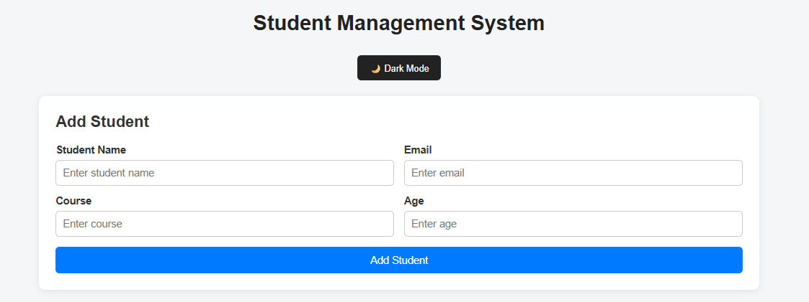
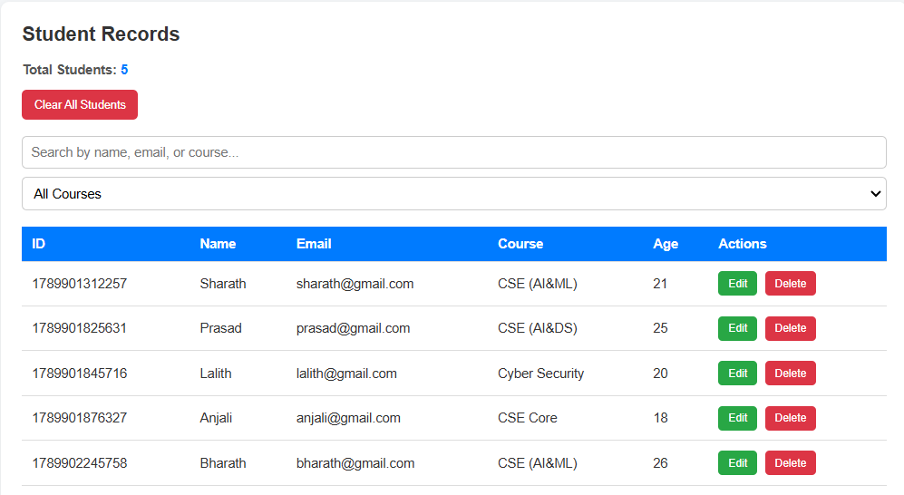

# Student Management System

A simple and responsive **Student Management System** developed as a **Web Development Minor Project during my internship at Corizo Edutech Private Limited**.

This application implements **CRUD (Create, Read, Update, Delete)** operations using **HTML, CSS, JavaScript, and LocalStorage**.

---

## 📌 Project Overview

The Student Management System is a web-based application developed to manage student records through a simple and user-friendly interface.

The project was developed as part of my **Web Development Minor Project during my internship period at Corizo Edutech Private Limited**.

Users can:

- Add new students
- View student records
- Edit existing student details
- Delete individual students
- Delete all student records
- Search student records
- Store data using LocalStorage
- Validate student input
- Switch between Light Mode and Dark Mode
- Preserve the selected theme using LocalStorage

---

## 🎯 Project Objective

The main objective of this project is to understand and implement the fundamental concepts of web development by creating a functional CRUD-based web application.

Through this project, I practiced:

- HTML form creation
- CSS styling and responsive design
- JavaScript programming
- DOM manipulation
- Event handling
- CRUD operations
- LocalStorage
- Form validation
- Search functionality
- Light/Dark theme implementation

---

## 🛠️ Technologies Used

| Technology | Purpose |
|---|---|
| HTML5 | Structure of the web application |
| CSS3 | Styling and responsive design |
| JavaScript | Application logic and CRUD operations |
| LocalStorage | Persistent storage of student records |

---

## ✨ Features

### 1. Create Student

Users can add a new student by entering:

- Student Name
- Email
- Course
- Age

The student information is stored in LocalStorage.

### 2. Read Student Records

All saved student records are displayed in a table containing:

- ID
- Name
- Email
- Course
- Age
- Actions

### 3. Update Student

Users can edit an existing student record and update the stored information.

### 4. Delete Student

Users can delete an individual student record using the Delete button.

### 5. Clear All Students

The application provides an option to delete all student records at once.

### 6. Search Students

Users can search student records using:

- Student Name
- Email
- Course

### 7. Data Validation

The application validates user input before saving student records.

The form checks important fields such as:

- Student name
- Email
- Course
- Age

### 8. LocalStorage

Student records are stored using the browser's LocalStorage.

This allows the records to remain available even after refreshing or reopening the webpage.

### 9. Dark Mode

Users can switch between:

- 🌙 Dark Mode
- ☀️ Light Mode

The selected theme is also stored using LocalStorage.

---

## 📷 Screenshots

### Student Form



### Student Records



---

## 📂 Project Structure

```text
Web_Development_CRUD/
│
├── screenshots/
│   ├── student-form.png
│   └── student-records.png
│
├── index.html
├── style.css
├── script.js
└── README.md
```

---

## ⚙️ How to Run the Project

### Step 1

Clone or download this repository.

### Step 2

Open the project folder:

```text
Web_Development_CRUD
```

### Step 3

Open the following file in a web browser:

```text
index.html
```

### Step 4

The Student Management System will open in the browser.

You can then add, view, search, edit, and delete student records.

---

## 🔄 CRUD Operations

| Operation | Description |
|---|---|
| Create | Add a new student record |
| Read | View existing student records |
| Update | Modify an existing student record |
| Delete | Remove an individual student record |

---

## 💾 Data Storage

This project uses **LocalStorage** to store student information in the browser.

The stored data can remain available after:

- Page refresh
- Browser reopening
- Returning to the application

The application does not require a separate database for its current implementation.

---

## 📱 Responsive Design

The application is designed to work across different screen sizes.

The layout adjusts for smaller screens using responsive CSS techniques.

---

## 🌙 Theme Support

The application provides Light Mode and Dark Mode.

The selected theme is saved in LocalStorage so that the user's theme preference can be retained.

---

## 📚 Learning Outcomes

During the development of this project, I gained practical experience in:

- Designing HTML forms
- Creating responsive layouts using CSS
- Working with JavaScript
- Manipulating HTML elements using the DOM
- Handling user events
- Implementing CRUD operations
- Working with browser LocalStorage
- Performing input validation
- Implementing search functionality
- Creating a theme-switching feature
- Organizing a web development project
- Managing and publishing a project using Git and GitHub

---

## 🚀 Future Improvements

The project can be further enhanced by adding:

- Backend integration
- Database connectivity
- User authentication
- Student profile management
- Advanced filtering
- Sorting functionality
- Export student records to CSV
- Cloud-based data storage
- User roles and access control

---

## 🏢 Internship Project

**Internship Organization:** Corizo Edutech Private Limited

**Project Type:** Web Development Minor Project

**Project Title:** Student Management System – CRUD Application

**Technologies:** HTML, CSS, JavaScript, LocalStorage

---

## 👨‍💻 Developer

**VENKATA SHARATH KUMAR JAKKI**

Web Development Minor Project

---

# Connect With Me

**LinkedIn:** [linkedin.com/in/venkata-sharath-kumar-jakki-536947329](https://linkedin.com/in/venkata-sharath-kumar-jakki-536947329)

**GitHub:** [github.com/sharathjakki1316](https://github.com/sharathjakki1316)

---

## Thank You

**Thank you for visiting my project repository and reviewing my Web Development Minor Project completed during my internship at Corizo Edutech Private Limited.**

**© 2026 VENKATA SHARATH KUMAR JAKKI**
